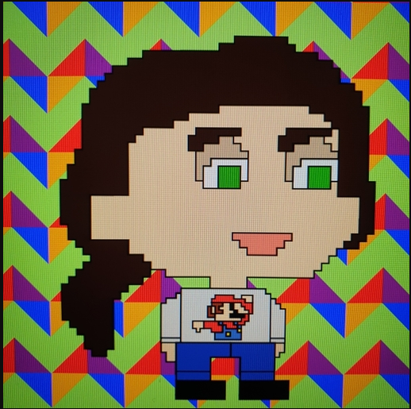

## Hi there, this is my GitHub page 👋

#### My name is Becky.

##### Only Rebecca if official or in trouble (so either way I panic 😱)

Before School of Code I was looking after my family and before that I did childcare at college (so the mental age didn't change 😄).
  
Now getting into code and tech as I want a career more than a job with the end goal being not dreading the alarm clock going of in the morning (other than it being in the morning 🥱).
  
My github picture is my teddy Quackers, what I actually look like (Go Wasps! 🐝)
  
&nbsp; &nbsp;

### Im currently working on...

*Building my portfolio
*Developing projects
*Cementing my skills
*Commiting to muscle memory (git commiting)

<!--
**Beckster6211/Beckster6211** is a ✨ _special_ ✨ repository because its `README.md` (this file) appears on your GitHub profile.

Here are some ideas to get you started:

- 🔭 I’m currently working on ...
- 🌱 I’m currently learning ...
- 👯 I’m looking to collaborate on ...
- 🤔 I’m looking for help with ...
- 💬 Ask me about ...
- 📫 How to reach me: ...
- 😄 Pronouns: ...
- ⚡ Fun fact: ...
-->
