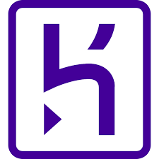

# Hi there, this is my GitHub page 👋

#### My name is Becky.

##### Only Rebecca if official or in trouble (so either way I panic 😱)

Before School of Code I was looking after my family and before that I did childcare at college (so the mental age didn't change 😄).
  
Now getting into code and tech as I want a career more than a job with the end goal being not dreading the alarm clock going of in the morning (other than it being in the morning 🥱).
  
My github picture is my teddy Quackers, heres what I actually look like (Go Wasps! 🐝)
  
&nbsp; &nbsp;

## ⚙️ Currently working on... 👷

<ul>
<li>Building my portfolio</li>
<li>Developing projects</li>
<li>Cementing my skills</li>
<li>Commiting to muscle memory (git commiting)</li>
</ul>
<a href = "https://becky-jones-portfolio.netlify.app/"> Becky Jones Portfolio</a>

## 💻 Technologies and Tools 🛠️

<ul>
<li>HTMLCSS  JavaScript </li>
<li>Netlify  Heroku  PostgresSQL </li>
<li>ReactNode </li>
<li>Auth0 </li>
<li>GitHub </li>
<li>Cypress  Jest  (I like testing) </li>

###### Cypress user flow test of Final project on School of Code EngageMate https://youtu.be/gDi8sqTd88s

###### EngageMate - School of Code final project https://engagemate.netlify.app/

</ul>

## Ask me about 🤔

I love animation and cartoons feel free to ask me about Disney, Pixar, Dreamworks, Laika, Aardman, Lionsgate, Tom and Jerry, The Beano... ✏️
  
Or you can ask me technological questions about my journey and things I've done 🤷‍♀️

## ✉️ Get in touch 🤙

↖️ You can check out my LinkedIn profile with the link on the left. You can use that to get in touch with me.

## Fun fact:

<ul>
<li>Walt Disney was musaphobic (he had an irrational fear of mice) 🐀 </li>
</ul>

###### and I like emojis (you might have guessed 😁 )

<!--
**Beckster6211/Beckster6211** is a ✨ _special_ ✨ repository because its `README.md` (this file) appears on your GitHub profile.

Here are some ideas to get you started:

- 🔭 I’m currently working on ...
- 🌱 I’m currently learning ...
- 👯 I’m looking to collaborate on ...
- 🤔 I’m looking for help with ...
- 💬 Ask me about ...
- 📫 How to reach me: ...
- 😄 Pronouns: ...
- ⚡ Fun fact: ...
  -->
